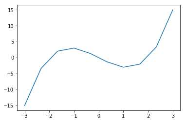
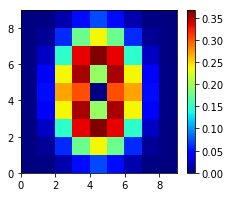

# 2차원 그래프 그리기


```python
#그래프 1-1
import numpy as np
import matplotlib.pyplot as plt
%matplotlib inline 
#^주피터에서 그래프표시

#data 작성
np.random.seed(1) 
x = np.arange(10)
y = np.random.rand(10)

#그래프 표시
plt.plot(x,y) 
plt.show() 
```


```python
%reset
```

    Once deleted, variables cannot be recovered. Proceed (y/[n])? y
    

# 3차 함수 f(x) = (x-2)x(x+2) 그리기


```python
import numpy as np
import matplotlib.pyplot as plt
%matplotlib inline
def f(x):
    return (x-2)*x*(x+2)
```


```python
print(f(1))
```

    -3
    


```python
print(f(np.array([1,2,3])))
```

    [-3  0 15]
    


```python
x = np.arange(-3,3.5,0.5)
print(x)
```

    [-3.  -2.5 -2.  -1.5 -1.  -0.5  0.   0.5  1.   1.5  2.   2.5  3. ]
    


```python
x = np.linspace(-3,3,10)
print(np.round(x,2))
```

    [-3.   -2.33 -1.67 -1.   -0.33  0.33  1.    1.67  2.33  3.  ]
    


```python
plt.plot(x,f(x))
plt.show()
```





```python
def f2(x,w):
    return (x-w)*x*(x+2)

x = np.linspace(-3,3,100)

plt.plot(x,f2(x,2), color='black', label='$w=2$')
plt.plot(x,f2(x,1), color='cornflowerblue',label='$w=1$')
plt.legend(loc="upper left")
plt.ylim(-15,15)
plt.title('$f_2(x)$')
plt.xlabel('$x$')
plt.ylabel('$y$')
plt.grid(True)
plt.show()
```


```python
import matplotlib
matplotlib.colors.cnames
```


    {'aliceblue': '#F0F8FF',
     'antiquewhite': '#FAEBD7',
     'aqua': '#00FFFF',
     'aquamarine': '#7FFFD4',
     'azure': '#F0FFFF',
     'beige': '#F5F5DC',
     'bisque': '#FFE4C4',
     'black': '#000000',
     'blanchedalmond': '#FFEBCD',
     'blue': '#0000FF',
     'blueviolet': '#8A2BE2',
     'brown': '#A52A2A',
     'burlywood': '#DEB887',
     'cadetblue': '#5F9EA0',
     'chartreuse': '#7FFF00',
     'chocolate': '#D2691E',
     'coral': '#FF7F50',
     'cornflowerblue': '#6495ED',
     'cornsilk': '#FFF8DC',
     'crimson': '#DC143C',
     'cyan': '#00FFFF',
     'darkblue': '#00008B',
     'darkcyan': '#008B8B',
     'darkgoldenrod': '#B8860B',
     'darkgray': '#A9A9A9',
     'darkgreen': '#006400',
     'darkgrey': '#A9A9A9',
     'darkkhaki': '#BDB76B',
     'darkmagenta': '#8B008B',
     'darkolivegreen': '#556B2F',
     'darkorange': '#FF8C00',
     'darkorchid': '#9932CC',
     'darkred': '#8B0000',
     'darksalmon': '#E9967A',
     'darkseagreen': '#8FBC8F',
     'darkslateblue': '#483D8B',
     'darkslategray': '#2F4F4F',
     'darkslategrey': '#2F4F4F',
     'darkturquoise': '#00CED1',
     'darkviolet': '#9400D3',
     'deeppink': '#FF1493',
     'deepskyblue': '#00BFFF',
     'dimgray': '#696969',
     'dimgrey': '#696969',
     'dodgerblue': '#1E90FF',
     'firebrick': '#B22222',
     'floralwhite': '#FFFAF0',
     'forestgreen': '#228B22',
     'fuchsia': '#FF00FF',
     'gainsboro': '#DCDCDC',
     'ghostwhite': '#F8F8FF',
     'gold': '#FFD700',
     'goldenrod': '#DAA520',
     'gray': '#808080',
     'green': '#008000',
     'greenyellow': '#ADFF2F',
     'grey': '#808080',
     'honeydew': '#F0FFF0',
     'hotpink': '#FF69B4',
     'indianred': '#CD5C5C',
     'indigo': '#4B0082',
     'ivory': '#FFFFF0',
     'khaki': '#F0E68C',
     'lavender': '#E6E6FA',
     'lavenderblush': '#FFF0F5',
     'lawngreen': '#7CFC00',
     'lemonchiffon': '#FFFACD',
     'lightblue': '#ADD8E6',
     'lightcoral': '#F08080',
     'lightcyan': '#E0FFFF',
     'lightgoldenrodyellow': '#FAFAD2',
     'lightgray': '#D3D3D3',
     'lightgreen': '#90EE90',
     'lightgrey': '#D3D3D3',
     'lightpink': '#FFB6C1',
     'lightsalmon': '#FFA07A',
     'lightseagreen': '#20B2AA',
     'lightskyblue': '#87CEFA',
     'lightslategray': '#778899',
     'lightslategrey': '#778899',
     'lightsteelblue': '#B0C4DE',
     'lightyellow': '#FFFFE0',
     'lime': '#00FF00',
     'limegreen': '#32CD32',
     'linen': '#FAF0E6',
     'magenta': '#FF00FF',
     'maroon': '#800000',
     'mediumaquamarine': '#66CDAA',
     'mediumblue': '#0000CD',
     'mediumorchid': '#BA55D3',
     'mediumpurple': '#9370DB',
     'mediumseagreen': '#3CB371',
     'mediumslateblue': '#7B68EE',
     'mediumspringgreen': '#00FA9A',
     'mediumturquoise': '#48D1CC',
     'mediumvioletred': '#C71585',
     'midnightblue': '#191970',
     'mintcream': '#F5FFFA',
     'mistyrose': '#FFE4E1',
     'moccasin': '#FFE4B5',
     'navajowhite': '#FFDEAD',
     'navy': '#000080',
     'oldlace': '#FDF5E6',
     'olive': '#808000',
     'olivedrab': '#6B8E23',
     'orange': '#FFA500',
     'orangered': '#FF4500',
     'orchid': '#DA70D6',
     'palegoldenrod': '#EEE8AA',
     'palegreen': '#98FB98',
     'paleturquoise': '#AFEEEE',
     'palevioletred': '#DB7093',
     'papayawhip': '#FFEFD5',
     'peachpuff': '#FFDAB9',
     'peru': '#CD853F',
     'pink': '#FFC0CB',
     'plum': '#DDA0DD',
     'powderblue': '#B0E0E6',
     'purple': '#800080',
     'rebeccapurple': '#663399',
     'red': '#FF0000',
     'rosybrown': '#BC8F8F',
     'royalblue': '#4169E1',
     'saddlebrown': '#8B4513',
     'salmon': '#FA8072',
     'sandybrown': '#F4A460',
     'seagreen': '#2E8B57',
     'seashell': '#FFF5EE',
     'sienna': '#A0522D',
     'silver': '#C0C0C0',
     'skyblue': '#87CEEB',
     'slateblue': '#6A5ACD',
     'slategray': '#708090',
     'slategrey': '#708090',
     'snow': '#FFFAFA',
     'springgreen': '#00FF7F',
     'steelblue': '#4682B4',
     'tan': '#D2B48C',
     'teal': '#008080',
     'thistle': '#D8BFD8',
     'tomato': '#FF6347',
     'turquoise': '#40E0D0',
     'violet': '#EE82EE',
     'wheat': '#F5DEB3',
     'white': '#FFFFFF',
     'whitesmoke': '#F5F5F5',
     'yellow': '#FFFF00',
     'yellowgreen': '#9ACD32'}


# 그래프 여러개 보여주기 (subplot이용)


```python
plt.figure(figsize=(10,3))
plt.subplots_adjust(wspace=0.5,hspace=0.5)
for i in range(6):
    plt.subplot(2,3,i+1)
    plt.title(i+1)
    plt.plot(x,f2(x,i),'k')
    plt.ylim(-20,20)
    plt.grid(True)
plt.show()
    
```


# 3차원 그래프 그리기


```python
import numpy as np
import matplotlib.pyplot as plt

def f3(x0,x1):
    r =2*x0**2+x1**2
    ans =r*np.exp(-r)
    return ans
xn =9
x0 = np.linspace(-2,2,xn)
x1 = np.linspace(-2,2,xn)

y = np.zeros((len(x0),len(x1)))

for i0 in range(xn):
    for i1 in range(xn):
        y[i1,i0] = f3(x0[i0],x1[i1])
print(np.round(y,1))
```

    [[0.  0.  0.  0.  0.1 0.  0.  0.  0. ]
     [0.  0.  0.1 0.2 0.2 0.2 0.1 0.  0. ]
     [0.  0.  0.1 0.3 0.4 0.3 0.1 0.  0. ]
     [0.  0.  0.2 0.4 0.2 0.4 0.2 0.  0. ]
     [0.  0.  0.3 0.3 0.  0.3 0.3 0.  0. ]
     [0.  0.  0.2 0.4 0.2 0.4 0.2 0.  0. ]
     [0.  0.  0.1 0.3 0.4 0.3 0.1 0.  0. ]
     [0.  0.  0.1 0.2 0.2 0.2 0.1 0.  0. ]
     [0.  0.  0.  0.  0.1 0.  0.  0.  0. ]]
    

# 수치를 색으로 표현하기(pcolor)


```python
plt.figure(figsize=(3.5,3))
plt.jet()
plt.pcolor(y)
plt.colorbar()
plt.show()
```





# 함수의 표면을 표시하기(surface)


```python
from mpl_toolkits.mplot3d import Axes3D
xx0,xx1 = np.meshgrid(x0,x1)
plt.figure(figsize=(5,3.5))
ax = plt.subplot(1,1,1,projection='3d')
ax.plot_surface(xx0,xx1,y,rstride=1,cstride=1,alpha=0.3,color='blue',edgecolor='black')
ax.set_zticks((0,0.2))
ax.view_init(50,-95)
plt.show()
```


# 등고선으로 표시(contour)


```python
xn =50
x0 = np.linspace(-2,2,xn)
x1= np.linspace(-2,2,xn)

y= np.zeros((len(x0),len(x1)))

for i0 in range(xn):
    for i1 in range(xn):
        y[i1,i0] = f3(x0[i0],x1[i1])
        
xx0,xx1 = np.meshgrid(x0,x1)

plt.figure(1,(4,4))
cont=plt.contour(xx0,xx1,y,5,colors='black')
cont.clabel(fmt='%3.2f',fontsize=8)
plt.xlabel('$x_0$',fontsize=14)
plt.ylabel('$x_1$',fontsize=14)
plt.show()


```


