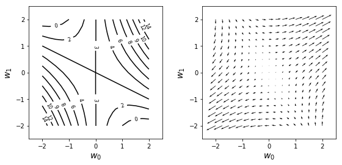
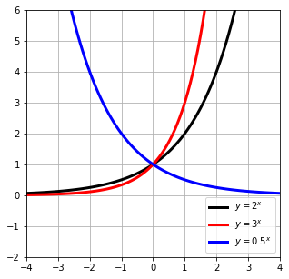
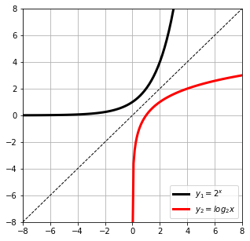
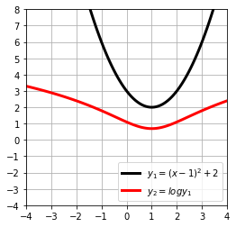
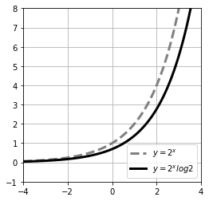
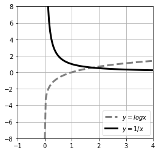
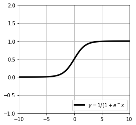
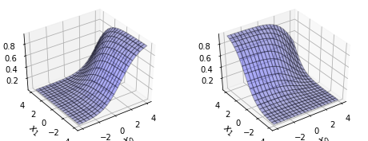
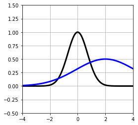
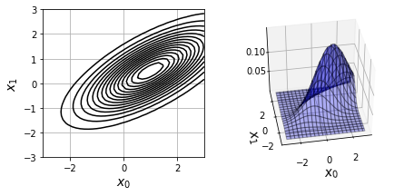

# 벡터


```python
import numpy as np
a = np.array([2,1])
print(a)
```

    [2 1]
    


```python
type(a)
```


    numpy.ndarray


```python
c = np.array([[1,2],[3,3]])
print(c)
```

    [[1 2]
     [3 3]]
    

세로 벡터


```python
print(d.T)
```

    [[1 2]]
    

전치 표현


```python
d = np.array([[1],[2]])
print(d)
```

    [[1]
     [2]]
    

사칙연산


```python
a = np.array([2,1])
b = np.array([1,3])
print(a+b)
print(a-b)
```

    [3 4]
    [ 1 -2]
    


```python
print(a*2)
```

    [4 2]
    

내적


```python
print(a.dot(b))
```

    5
    

벡터의 크기


```python
a = np.array([1,3])
print(np.linalg.norm(a))
```

    3.1622776601683795
    


```python
a = np.ones(1000)
b= np.arange(1,1001)
print(a.dot(b))
```

    500500.0
    

경사를 그림으로 표현


```python
import numpy as np
import matplotlib.pyplot as plt
%matplotlib inline
def f(w0,w1):
    return w0**2+2*w0*w1+3 
def df_dw0(w0,w1): #f의 w0에 관한 편미분
    return 2*w0+2*w1
def df_dw1(w0,w1): #f의 w1에 관한 편미분
    return 2*w0+0*w1 

w_range =2
dw =0.25

w0 = np.arange(-w_range,w_range+dw,dw)
w1 = np.arange(-w_range,w_range+dw,dw)

wn = w0.shape[0]
ww0,ww1 = np.meshgrid(w0,w1)


ff = np.zeros((len(w0),len(w1)))
dff_dw0 = np.zeros((len(w0),len(w1))) #w0방향의 편미분을 돌려주는 함수
dff_dw1 = np.zeros((len(w0),len(w1))) #w1방향의 편미분을 돌려주는 함수

for i0 in range(wn):
    for i1 in range(wn):
        ff[i1,i0] = f(w0[i0],w1[i1])
        dff_dw0[i1,i0] = df_dw0(w0[i0],w1[i1])
        dff_dw1[i1,i0] = df_dw1(w0[i0],w1[i1])

plt.figure(figsize=(9,4))
plt.subplots_adjust(wspace=0.3)
plt.subplot(1,2,1)
cont = plt.contour(ww0,ww1,ff,10,colors='k') #f의 등고선 표시
cont.clabel(fmt='%2.0f',fontsize=8)

plt.xticks(range(-w_range,w_range+1,1))
plt.yticks(range(-w_range,w_range+1,1))
plt.xlim(-w_range-0.5,w_range+.5)
plt.ylim(-w_range -.5,w_range+.5)
plt.xlabel('$w_0$',fontsize=14)
plt.ylabel('$w_1$',fontsize=14)

plt.subplot(1,2,2)
plt.quiver(ww0,ww1,dff_dw0,dff_dw1) #f의 경사벡터 표시
plt.xticks(range(-w_range,w_range+1,1))
plt.yticks(range(-w_range,w_range+1,1))
plt.xlim(-w_range-0.5,w_range+.5)
plt.ylim(-w_range -.5,w_range+.5)
plt.xlabel('$w_0$',fontsize=14)
plt.ylabel('$w_1$',fontsize=14)

plt.show()
```





# 행렬


```python
import numpy as np
```


```python
a = np.array([[1,2,3],[4,5,6]])
print(a)
```

    [[1 2 3]
     [4 5 6]]
    


```python
b= np.array([[4,5,6],[1,2,3]])
print(a+b)
print(a-b)
```

    [[5 7 9]
     [5 7 9]]
    [[-3 -3 -3]
     [ 3  3  3]]
    


```python
c = np.array([[1,1],[2,2],[3,3]])
print(b.dot(c))
```

    [[32 32]
     [14 14]]
    

단위 행렬


```python
print(np.identity(3))
```

    [[1. 0. 0.]
     [0. 1. 0.]
     [0. 0. 1.]]
    


```python
A = np.array([[1,2,3],[2,2,2],[3,3,3]])
I = np.identity(3)
print(A.dot(I))
```

    [[1. 2. 3.]
     [2. 2. 2.]
     [3. 3. 3.]]
    

역행렬


```python
A =np.array([[1,2],[3,4]])
invA = np.linalg.inv(A)
print(invA)
```

    [[-2.   1. ]
     [ 1.5 -0.5]]
    


```python
print(A)
print(A.T)
```

    [[1 2]
     [3 4]]
    [[1 3]
     [2 4]]
    

# 지수함수와 로그함수


```python
import numpy as np
import matplotlib.pyplot as plt
%matplotlib inline
x = np.linspace(-4,4,100)
y = 2**x
y2 = 3**x
y3 = 0.5**x

plt.figure(figsize=(5,5))
plt.plot(x,y,'black',linewidth=3,label='$y=2^x$')
plt.plot(x,y2,'red',linewidth=3,label='$y=3^x$')
plt.plot(x,y3,'blue',linewidth=3,label='$y=0.5^x$')

plt.ylim(-2,6)
plt.xlim(-4,4)
plt.grid(True)
plt.legend(loc='lower right')
plt.show()
```





```python
x = np.linspace(-8,8,100)
y =2**x

x2 = np.linspace(0.001,8,100)
y2 = np.log(x2)/np.log(2)
plt.figure(figsize=(5,5))
plt.plot(x,y,'k',linewidth=3,label='$y_1=2^x$')
plt.plot(x2,y2,'red',linewidth=3,label='$y_2=log_2x$')
plt.plot(x,x,'k',linestyle='--',linewidth=1)
plt.ylim(-8,8)
plt.xlim(-8,8)
plt.grid(True)
plt.legend(loc='lower right')
plt.show()
```





일반 함수에 로그를 취해도 최소값을 가지는 입력값은 같다.


```python
x = np.linspace(-4,4,100)
y =(x-1)**2+2
logy=np.log(y)

plt.figure(figsize=(4,4))
plt.plot(x,y,'k',linewidth=3,label='$y_1=(x-1)^2+2$')
plt.plot(x,logy,'red',linewidth=3,label='$y_2=logy_1$')

plt.yticks(range(-4,9,1))
plt.xticks(range(-4,5,1))
plt.ylim(-4,8)
plt.xlim(-4,4)
plt.grid(True)
plt.legend(loc='lower right')
plt.show()
```





지수 함수의 미분


```python
x =np.linspace(-4,4,100)
a =2
y = a**x
dy = np.log(a)*y

plt.figure(figsize=(4,4))
plt.plot(x,y,'gray',linestyle='--',linewidth=3,label='$y=2^x$')
plt.plot(x,dy,'k',linewidth=3,label='$y=2^xlog2$')
plt.ylim(-1,8)
plt.xlim(-4,4)
plt.grid(True)
plt.legend(loc='lower right')
plt.show()
```





로그 함수의 미분


```python
x =np.linspace(0.0001,4,100)
y = np.log(x)
dy = 1/x

plt.figure(figsize=(4,4))
plt.plot(x,y,'gray',linestyle='--',linewidth=3,label='$y=logx$')
plt.plot(x,dy,'k',linewidth=3,label='$y=1/x$')
plt.ylim(-8,8)
plt.xlim(-1,4)
plt.grid(True)
plt.legend(loc='lower right')
plt.show()
```





# 시그모이드 함수


```python
x = np.linspace(-10,10,100)
y = 1/(1+np.exp(-x))

plt.figure(figsize=(4,4))
plt.plot(x,y,'k',linewidth=3,label='$y=1/(1+e^-x$')

plt.ylim(-1,2)
plt.xlim(-10,10)
plt.grid(True)
plt.legend(loc='lower right')
plt.show()
```





# 소프트맥스 함수


```python
def softmax(x0,x1,x2):
    u = np.exp(x0)+np.exp(x1)+np.exp(x2)
    return np.exp(x0)/u,np.exp(x1)/u,np.exp(x2)/u
y = softmax(2,1,-1) 
print(np.round(y,2)) 
print(np.sum(y))
```

    [0.71 0.26 0.04]
    1.0
    


```python
from mpl_toolkits.mplot3d import Axes3D

xn =20
x0 = np.linspace(-4,4,xn)
x1 =np.linspace(-4,4,xn)

y= np.zeros((xn,xn,3))

for i0 in range(xn):
    for i1 in range(xn):
        y[i1,i0,:] = softmax(x0[i0],x1[i1],1)
xx0,xx1 = np.meshgrid(x0,x1)

plt.figure(figsize=(8,3))
for i in range(2):
    ax = plt.subplot(1,2,i+1,projection='3d')
    
    ax.plot_surface(xx0,xx1,y[:,:,i],rstride=1,cstride=1,alpha=0.3,color='blue',edgecolor='k')
    
    
    ax.set_xlabel('$x_0$',fontsize=12)
    ax.set_ylabel('$x_1$',fontsize=12)
    
    ax.view_init(40,-125)
    
plt.show()
```





# 가우스 함수


```python
def gauss(mu,sigma,a):
    return a*np.exp(-(x-mu)**2 / sigma**2)

x = np.linspace(-4,4,100)
plt.figure(figsize=(4,4))
plt.plot(x,gauss(0,1,1),'k',linewidth=3)
plt.plot(x,gauss(2,3,0.5),'blue',linewidth=3)
plt.ylim(-.5,1.5)
plt.xlim(-4,4)
plt.grid(True)
plt.show()

```





```python
def gauss(x,mu,sigma):
    N,D =x.shape
    c1 = 1/(2*np.pi)**(D/2)
    c2 =1/(np.linalg.det(sigma)**(1/2))
    
    inv_sigma = np.linalg.inv(sigma)
    c3 = x-mu
    c4 = np.dot(c3,inv_sigma)
    c5=np.zeros(N)
    for d in range(D):
        c5 = c5+c4[:,d]*c3[:,d]
        
    p=c1*c2*np.exp(-c5/2)
    
    return p

x = np.array([[1,2],[2,1],[3,4]])
mu = np.array([1,2])
sigma= np.array([[1,0],[0,1]])
print(gauss(x,mu,sigma))
```

    [0.15915494 0.05854983 0.00291502]
    


```python
x_range0 = [-3,3]
x_range1=[-3,3]

#등고선 표시
def show_contour_gauss(mu,sig):
    xn =40 # 등고선 해상도
    x0 = np.linspace(x_range0[0],x_range0[1],xn)
    x1 =np.linspace(x_range1[0],x_range1[1],xn)
    xx0,xx1 = np.meshgrid(x0,x1)
    
    x= np.c_[np.reshape(xx0,xn*xn,1),np.reshape(xx1,xn*xn,1)]
    
    f = gauss(x,mu,sig)
    f =f.reshape(xn,xn)
    f = f.T
    
    cont = plt.contour(xx0,xx1,f,15,colors='k')
    
    plt.grid(True)
    
#3d 표시
def show3d_gauss(ax,mu,sig):
    xn =40 # 해상도
    x0 =np.linspace(x_range0[0],x_range0[1],xn)
    x1 =np.linspace(x_range1[0],x_range1[1],xn)
    xx0,xx1 = np.meshgrid(x0,x1)
    
    x= np.c_[np.reshape(xx0,xn*xn,1),np.reshape(xx1,xn*xn,1)]
    
    f = gauss(x,mu,sig)
    f = f.reshape(xn,xn)
    f = f.T
    
    ax.plot_surface(xx0,xx1,f,rstride=2,cstride=2,alpha=0.3,color='blue',edgecolor='k')
mu = np.array([1,0.5])
sigma = np.array([[2,1],[1,1]])
Fig = plt.figure(1,figsize=(7,3))
Fig.add_subplot(1,2,1)

show_contour_gauss(mu,sigma)

plt.xlim(x_range0)
plt.ylim(x_range1)
plt.xlabel('$x_0$',fontsize=14)
plt.ylabel('$x_1$',fontsize=14)
Ax=Fig.add_subplot(1,2,2,projection='3d')

show3d_gauss(Ax,mu,sigma)
Ax.set_zticks([0.05,0.10])
Ax.set_xlabel('$x_0$',fontsize=14)
Ax.set_ylabel('$x_1$',fontsize=14)
Ax.view_init(40,-100)

plt.show()
```





```python

```
